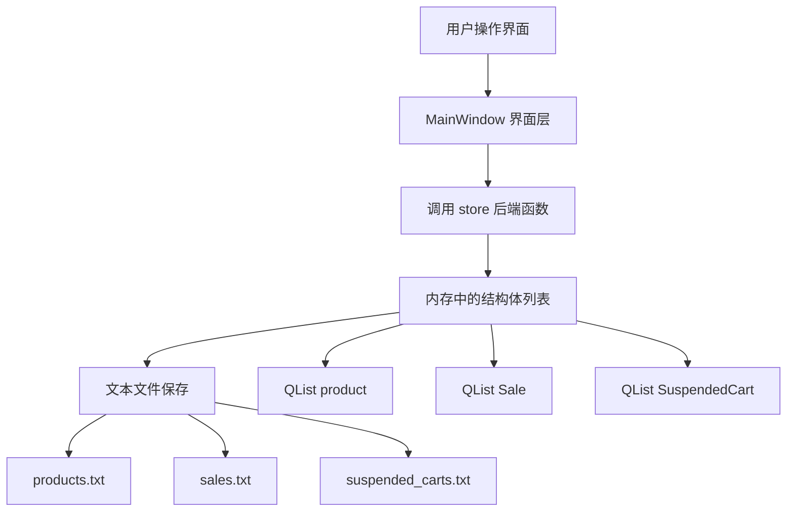
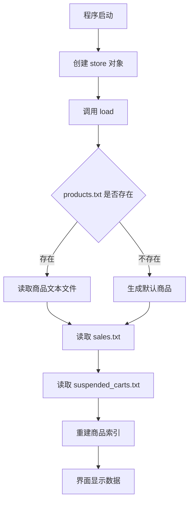
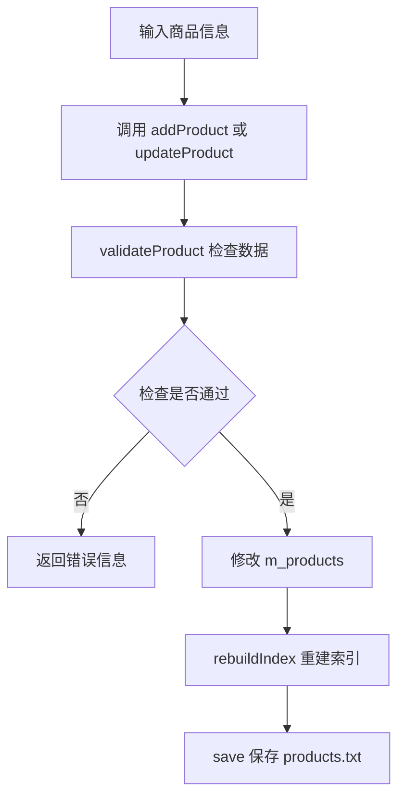
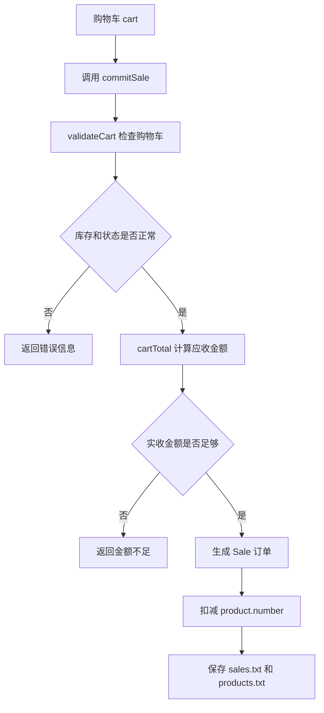
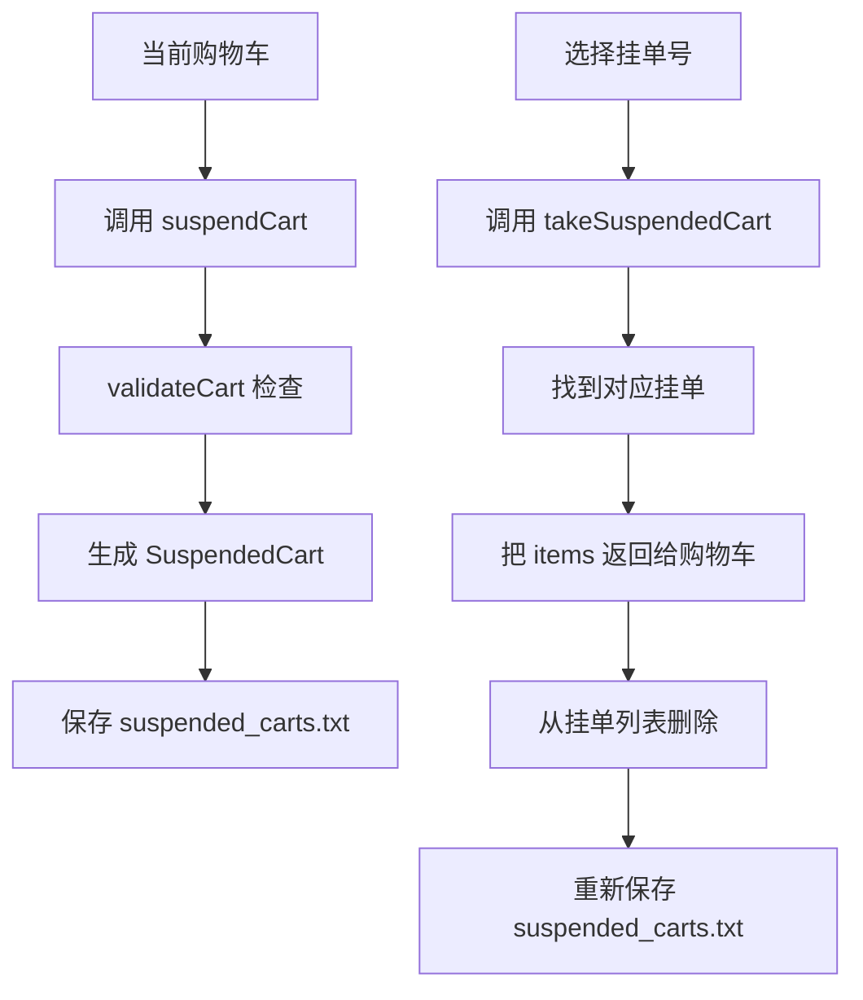

# 超市收银系统代码调用说明和流程图

本文档说明当前项目中 `store` 后端类的调用方式、文本文件保存格式，以及系统整体运行流程。当前版本保存数据时不使用 JSON，而是使用普通文本文件和结构体。

## 1. 项目文件分工

| 文件 | 作用 |
| --- | --- |
| `models.h` | 定义基础结构体，例如商品、购物车条目、销售订单、挂起订单。 |
| `store.h` | 声明后端类 `store`，外部代码通过这些函数调用后端。 |
| `store.cpp` | 实现数据读取、保存、商品管理、购物车校验、结算、挂单等功能。 |
| `mainwindow.h / mainwindow.cpp / mainwindow.ui` | Qt 界面文件。 |
| `main.cpp` | 程序入口。 |

## 2. 后端核心对象

| 结构体 | 主要成员 | 说明 |
| --- | --- | --- |
| `product` | `id`, `name`, `type`, `price`, `number`, `active` | 商品信息，`type` 表示类别，`number` 表示库存。 |
| `Cart_item` | `productId`, `quantity` | 购物车中的一项。 |
| `Sale_item` | `productId`, `name`, `unitPrice`, `quantity`, `subtotal` | 销售订单中的商品明细。 |
| `Sale` | `id`, `time`, `items`, `total`, `paid`, `change` | 一次完整结账记录。 |
| `SuspendedCart` | `id`, `time`, `items` | 暂时挂起但还没有结账的购物车。 |

## 3. store 类成员变量

| 成员变量 | 类型 | 作用 |
| --- | --- | --- |
| `m_products` | `QList<product>` | 保存所有商品。 |
| `m_sales` | `QList<Sale>` | 保存所有销售记录。 |
| `m_suspendedCarts` | `QList<SuspendedCart>` | 保存所有挂起订单。 |
| `m_dataDir` | `QString` | 数据文件保存目录。 |
| `m_productIndex` | `QHash<QString, int>` | 商品编号到商品下标的索引，用来快速查找商品。 |

## 4. 文本文件保存格式

程序运行时会在数据目录下创建三个文本文件。

### 4.1 products.txt

格式：

```text
id|name|type|price|number|active
```

示例：

```text
690001|矿泉水|饮品|2.00|120|1
690002|纯牛奶|乳品|4.50|80|1
690007|下架样品|测试|1.00|5|0
```

说明：

| 字段 | 含义 |
| --- | --- |
| `id` | 商品编号 |
| `name` | 商品名称 |
| `type` | 商品类别 |
| `price` | 商品价格 |
| `number` | 库存数量 |
| `active` | 是否上架，`1` 表示上架，`0` 表示下架 |

注意：当前是基础文本保存方式，商品名和类别里不要输入 `|`，否则会影响分割。

### 4.2 sales.txt

格式：

```text
SALE|订单号|时间|总价|实收|找零
ITEM|商品编号|商品名|单价|数量|小计
ENDSALE
```

示例：

```text
SALE|S202607071530001|2026-07-07T15:30:00|9.00|10.00|1.00
ITEM|690001|矿泉水|2.00|2|4.00
ITEM|690003|方便面|5.00|1|5.00
ENDSALE
```

### 4.3 suspended_carts.txt

格式：

```text
CART|挂单号|时间
ITEM|商品编号|数量
ENDCART
```

示例：

```text
CART|P202607071535001|2026-07-07T15:35:00
ITEM|690001|2
ITEM|690003|1
ENDCART
```

## 5. store 函数调用说明

### 5.1 创建后端对象

```cpp
store s("data");
```

作用：创建一个后端对象，数据文件会保存在 `data` 目录中。

### 5.2 加载数据

```cpp
QString error;
bool ok = s.load(&error);
```

作用：

- 读取 `products.txt`
- 读取 `sales.txt`
- 读取 `suspended_carts.txt`
- 如果没有商品文件，就创建默认商品

返回：

- `true` 表示加载成功
- `false` 表示加载失败，错误原因放在 `error` 中

### 5.3 保存数据

```cpp
QString error;
bool ok = s.save(&error);
```

作用：

- 把商品列表保存到 `products.txt`
- 把销售记录保存到 `sales.txt`
- 把挂起订单保存到 `suspended_carts.txt`

### 5.4 获取商品列表

```cpp
const QList<product> &list = s.products();
```

作用：给界面显示商品列表使用。

### 5.5 按编号查找商品

```cpp
const product *p = s.findProduct("690001");
```

作用：根据商品编号查找商品。  
如果找到，返回商品指针；如果没有找到，返回 `nullptr`。

### 5.6 新增商品

```cpp
product p;
p.id = "690008";
p.name = "面包";
p.type = "食品";
p.price = 6.50;
p.number = 30;
p.active = true;

QString error;
bool ok = s.addProduct(p, &error);
```

作用：

- 检查商品编号是否为空
- 检查商品名称是否为空
- 检查价格和库存是否合法
- 检查商品编号是否重复
- 添加成功后自动保存文本文件

### 5.7 修改商品

```cpp
QString error;
bool ok = s.updateProduct(p, &error);
```

作用：根据商品编号修改商品信息。

### 5.8 删除商品

```cpp
QString error;
bool ok = s.removeProduct("690008", &error);
```

作用：删除指定商品。  
如果挂起订单里还用到了这个商品，就不允许删除。

### 5.9 商品上下架

```cpp
QString error;
s.setProductActive("690001", false, &error); // 下架
s.setProductActive("690001", true, &error);  // 上架
```

作用：修改商品是否可以出售。

### 5.10 校验购物车

```cpp
QList<Cart_item> cart;
Cart_item item;
item.productId = "690001";
item.quantity = 2;
cart.append(item);

QString error;
bool ok = s.validateCart(cart, &error);
```

作用：

- 检查购物车是否为空
- 检查商品是否存在
- 检查商品是否上架
- 检查库存是否足够

### 5.11 计算购物车金额和件数

```cpp
double total = s.cartTotal(cart);
int count = s.cartItemCount(cart);
```

作用：

- `cartTotal` 计算总价
- `cartItemCount` 计算商品总件数

### 5.12 收银结算

```cpp
Sale sale;
QString error;
bool ok = s.commitSale(cart, 20.00, &sale, &error);
```

作用：

- 校验购物车
- 计算总价
- 检查实收金额是否足够
- 生成销售订单
- 扣减库存
- 保存文本文件

### 5.13 挂起订单

```cpp
SuspendedCart suspended;
QString error;
bool ok = s.suspendCart(cart, &suspended, &error);
```

作用：把当前购物车保存成挂起订单。

### 5.14 恢复挂起订单

```cpp
QList<Cart_item> cart;
QString error;
bool ok = s.takeSuspendedCart("P202607071535001", &cart, &error);
```

作用：根据挂单号取出购物车，并从挂起订单列表里删除。

## 6. 整体设计流程图

### 6.1 系统结构图



如果 Mermaid 不显示，可以看下面的普通文字版：

```text
用户操作
   ↓
Qt 界面 MainWindow
   ↓
调用 store 类函数
   ↓
结构体列表 QList<product> / QList<Sale> / QList<SuspendedCart>
   ↓
保存到 products.txt / sales.txt / suspended_carts.txt
```

### 6.2 程序启动流程



### 6.3 商品管理流程



### 6.4 收银结算流程



### 6.5 挂起和恢复流程



## 7. 当前文本保存方式的特点

优点：

- 文件格式简单，打开 txt 就能看懂。
- 适合课程实训，能体现“结构体 + 文件保存”。
- 不需要 JSON 相关类，代码更接近基础文件操作。

限制：

- 商品名、类别、订单商品名里不要写 `|`。
- 文本文件格式不能手动乱改，否则读取时会报格式错误。
- 如果以后要做真实项目，建议再升级成数据库或更完整的数据格式。

